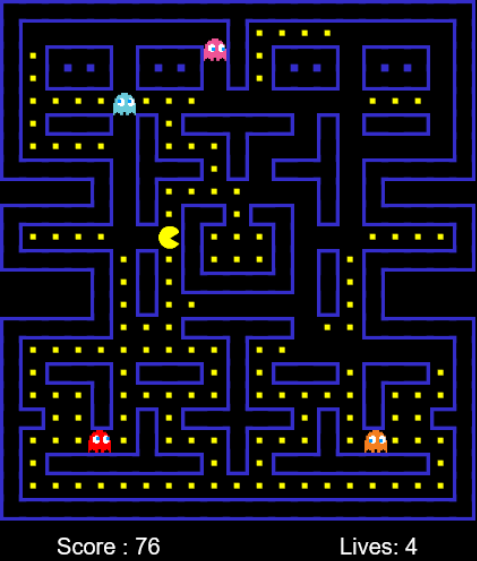

# Pacman



### Overview
A simple Pacman game created to experiment with JavaScript, the Canvas API, and keydown events. It was fun to break down big tasks into smaller functions. So much goes on behind the scenes in making games. 

Implemented BFS to find shortest path for the Ghosts

### Project Structure

- index.html: The main HTML file.
- game.js: Contains the main game loop and game-related functions.
- player.js: Manages the Pacman character.
- ghost.js: Manages the ghosts.

### Function Call Order

1. Initialization
``` js
createNewPacman()
createGhosts()
gameLoop()
setInterval(gameLoop, 1000/fps)
```
2. Game Loop
```js
draw() ->
    clear canvas
    drawWalls()
    food()
    pacman.draw()
    drawScore()
    drawGhosts()
    drawLives()
update() ->
    pacman.move()
    pacman.eat()
    updateGhosts()
    if pacman.checkGhostCollision(ghosts) -> onGhostCollision() ->
        decrement lives
        restartPacmanAndGhosts() -> createNewPacman() -> createGhosts()
        if lives == 0 -> gameOver() -> drawGameOver() -> clearInterval(gameInterval)
    if score == 219 -> drawWin() -> clearInterval(gameInterval)
```

3. Event Listener (keydown)
```js
Capture key press -> set pacman.nextDirection based on key press
```

#### Click [here](https://omkharade.github.io/pacman/) to play

#### Check out my next project - [Marketplace](https://github.com/OmKharade/mern-marketplace)

